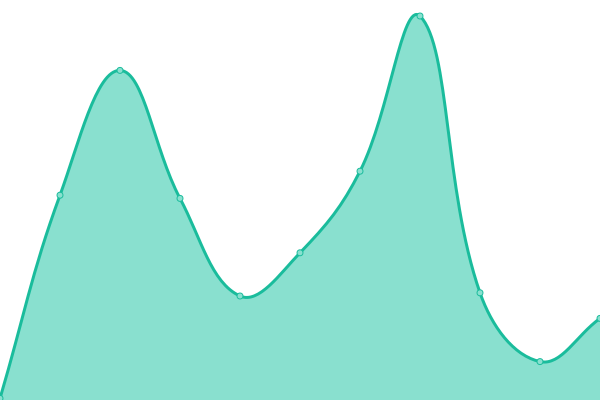
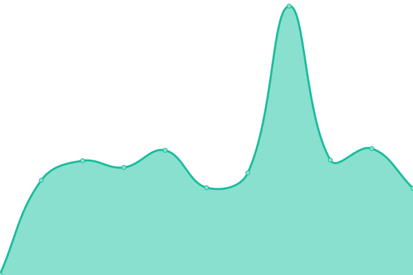
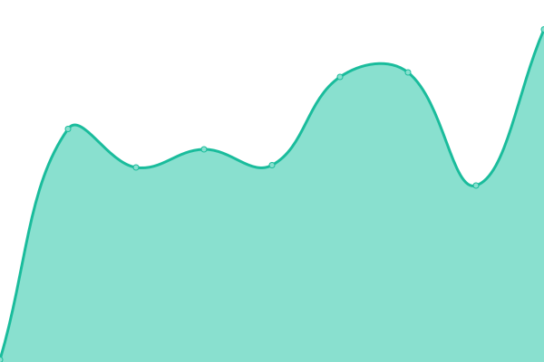
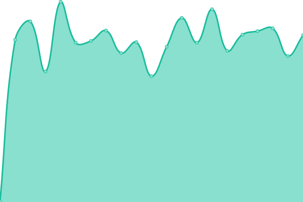
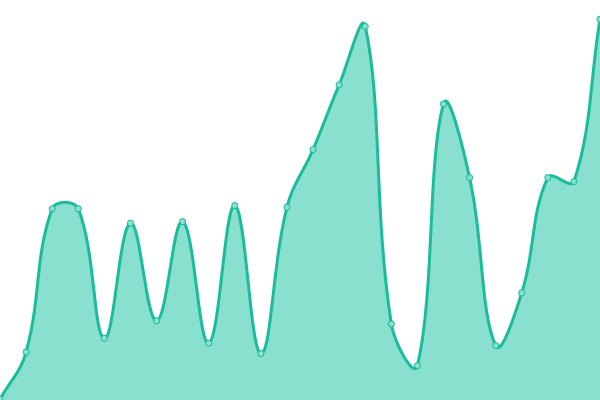
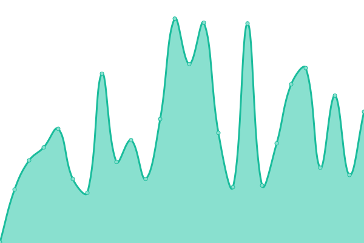
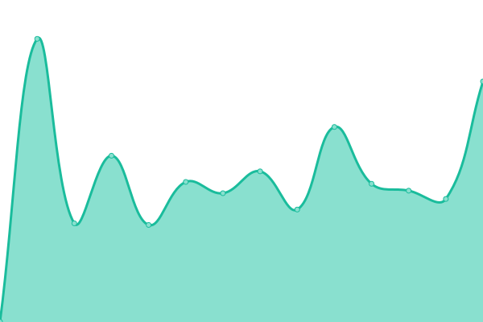
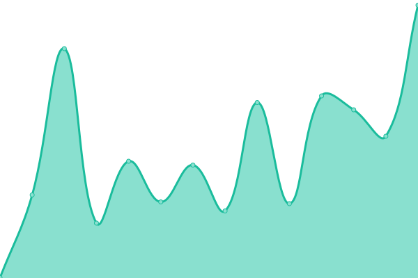
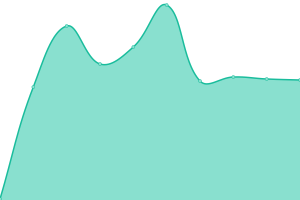

# [📈 Live Status](https://demo.upptime.js.org): <!--live status--> **🟩 All systems operational**

This repository contains the open-source uptime monitor and status page for [ld3zian](https://demo.upptime.js.org), powered by [Upptime](https://github.com/upptime/upptime).

With [Upptime](https://upptime.js.org), you can get your own unlimited and free uptime monitor and status page, powered entirely by a GitHub repository. We use [Issues](https://github.com/ld3z/status-checker/issues) as incident reports, [Actions](https://github.com/ld3z/status-checker/actions) as uptime monitors, and [Pages](https://demo.upptime.js.org) for the status page.

<!--start: status pages-->
<!-- This summary is generated by Upptime (https://github.com/upptime/upptime) -->
<!-- Do not edit this manually, your changes will be overwritten -->
<!-- prettier-ignore -->
| URL | Status | History | Response Time | Uptime |
| --- | ------ | ------- | ------------- | ------ |
|  [Google](https://www.google.com) | 🟩 Up | [google.yml](https://github.com/ld3z/status-checker/commits/HEAD/history/google.yml) | 

 142ms
     
 | 

<a href="https://ld3z.github.io/status-checker/history/google">100.00%</a>
    

|  [Amazon](https://www.amazon.com) | 🟩 Up | [amazon.yml](https://github.com/ld3z/status-checker/commits/HEAD/history/amazon.yml) | 

 177ms
     
 | 

<a href="https://ld3z.github.io/status-checker/history/amazon">100.00%</a>
    

|  [Roblox](https://www.roblox.com) | 🟩 Up | [roblox.yml](https://github.com/ld3z/status-checker/commits/HEAD/history/roblox.yml) | 

 787ms
     
 | 

<a href="https://ld3z.github.io/status-checker/history/roblox">100.00%</a>
    

|  [Roblox Games](https://gamejoin.roblox.com/) | 🟩 Up | [roblox-games.yml](https://github.com/ld3z/status-checker/commits/HEAD/history/roblox-games.yml) | 

 145ms
     
 | 

<a href="https://ld3z.github.io/status-checker/history/roblox-games">100.00%</a>
    

|  [YouTube](https://www.youtube.com) | 🟩 Up | [you-tube.yml](https://github.com/ld3z/status-checker/commits/HEAD/history/you-tube.yml) | 

 322ms
     
 | 

<a href="https://ld3z.github.io/status-checker/history/you-tube">100.00%</a>
    

|  [Twitch](https://www.twitch.tv) | 🟩 Up | [twitch.yml](https://github.com/ld3z/status-checker/commits/HEAD/history/twitch.yml) | 

 123ms
     
 | 

<a href="https://ld3z.github.io/status-checker/history/twitch">100.00%</a>
    

|  [9anime](https://9anime.to) | 🟩 Up | [9anime.yml](https://github.com/ld3z/status-checker/commits/HEAD/history/9anime.yml) | 

 341ms
     
 | 

<a href="https://ld3z.github.io/status-checker/history/9anime">100.00%</a>
    

|  [ComicK](https://comick.app) | 🟩 Up | [comic-k.yml](https://github.com/ld3z/status-checker/commits/HEAD/history/comic-k.yml) | 

 251ms
     
 | 

<a href="https://ld3z.github.io/status-checker/history/comic-k">97.35%</a>
    

|  [MangaDex](https://www.mangadex.org) | 🟩 Up | [manga-dex.yml](https://github.com/ld3z/status-checker/commits/HEAD/history/manga-dex.yml) | 

 368ms
     
 | 

<a href="https://ld3z.github.io/status-checker/history/manga-dex">100.00%</a>
    

|  [Github](https://www.github.com) | 🟩 Up | [github.yml](https://github.com/ld3z/status-checker/commits/HEAD/history/github.yml) | 

 419ms
     
 | 

<a href="https://ld3z.github.io/status-checker/history/github">100.00%</a>
    

|  [Discord](https://www.discord.com) | 🟩 Up | [discord.yml](https://github.com/ld3z/status-checker/commits/HEAD/history/discord.yml) | 

 185ms
     
 | 

<a href="https://ld3z.github.io/status-checker/history/discord">100.00%</a>
    

|  [Twitter](https://www.twitter.com) | 🟩 Up | [twitter.yml](https://github.com/ld3z/status-checker/commits/HEAD/history/twitter.yml) | 

 715ms
     
 | 

<a href="https://ld3z.github.io/status-checker/history/twitter">100.00%</a>
    

|  [Reddit](https://www.reddit.com) | 🟩 Up | [reddit.yml](https://github.com/ld3z/status-checker/commits/HEAD/history/reddit.yml) | 

 757ms
     
 | 

<a href="https://ld3z.github.io/status-checker/history/reddit">100.00%</a>
    

|  [Disney+](https://www.disneyplus.com) | 🟩 Up | [disney.yml](https://github.com/ld3z/status-checker/commits/HEAD/history/disney.yml) | 

 221ms
     
 | 

<a href="https://ld3z.github.io/status-checker/history/disney">100.00%</a>
    

|  [Steam](https://store.steampowered.com) | 🟩 Up | [steam.yml](https://github.com/ld3z/status-checker/commits/HEAD/history/steam.yml) | 

 417ms
     
 | 

<a href="https://ld3z.github.io/status-checker/history/steam">100.00%</a>
    

|  [Netflix](https://www.netflix.com) | 🟩 Up | [netflix.yml](https://github.com/ld3z/status-checker/commits/HEAD/history/netflix.yml) | 

 741ms
     
 | 

<a href="https://ld3z.github.io/status-checker/history/netflix">100.00%</a>
    

|  PowerSchool | 🟩 Up | [power-school.yml](https://github.com/ld3z/status-checker/commits/HEAD/history/power-school.yml) | 

 300ms
     
 | 

<a href="https://ld3z.github.io/status-checker/history/power-school">100.00%</a>
    

|  [Desmos](https://www.desmos.com) | 🟩 Up | [desmos.yml](https://github.com/ld3z/status-checker/commits/HEAD/history/desmos.yml) | 

 145ms
     
 | 

<a href="https://ld3z.github.io/status-checker/history/desmos">100.00%</a>
    

|  [Mathway](https://www.mathway.com) | 🟩 Up | [mathway.yml](https://github.com/ld3z/status-checker/commits/HEAD/history/mathway.yml) | 

 285ms
     
 | 

<a href="https://ld3z.github.io/status-checker/history/mathway">100.00%</a>
    

<!--end: status pages-->

[**Visit our status website →**](https://demo.upptime.js.org)

## 📄 License

- Powered by: [Upptime](https://github.com/upptime/upptime)
- Code: [MIT](./LICENSE) © [ld3zian](https://demo.upptime.js.org)
- Data in the `./history` directory: [Open Database License](https://opendatacommons.org/licenses/odbl/1-0/)
