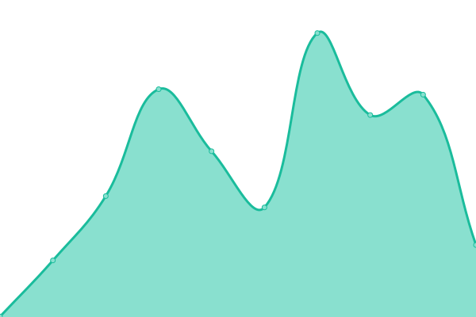

# [📈 Live Status](https://demo.upptime.js.org): <!--live status--> **🟩 All systems operational**

This repository contains the open-source uptime monitor and status page for [ld3zian](https://demo.upptime.js.org), powered by [Upptime](https://github.com/upptime/upptime).

With [Upptime](https://upptime.js.org), you can get your own unlimited and free uptime monitor and status page, powered entirely by a GitHub repository. We use [Issues](https://github.com/ld3z/status-checker/issues) as incident reports, [Actions](https://github.com/ld3z/status-checker/actions) as uptime monitors, and [Pages](https://demo.upptime.js.org) for the status page.

<!--start: status pages-->
<!-- This summary is generated by Upptime (https://github.com/upptime/upptime) -->
<!-- Do not edit this manually, your changes will be overwritten -->
<!-- prettier-ignore -->
| URL | Status | History | Response Time | Uptime |
| --- | ------ | ------- | ------------- | ------ |
|  [Google](https://www.google.com) | 🟩 Up | [google.yml](https://github.com/ld3z/status-checker/commits/HEAD/history/google.yml) | 

 84ms
     
 | 

<a href="https://ld3z.github.io/status-checker/history/google">100.00%</a>
    

|  [Roblox](https://www.roblox.com) | 🟩 Up | [roblox.yml](https://github.com/ld3z/status-checker/commits/HEAD/history/roblox.yml) | 

 238ms
     
 | 

<a href="https://ld3z.github.io/status-checker/history/roblox">100.00%</a>
    

|  [YouTube](https://www.youtube.com) | 🟩 Up | [you-tube.yml](https://github.com/ld3z/status-checker/commits/HEAD/history/you-tube.yml) | 

 276ms
     
 | 

<a href="https://ld3z.github.io/status-checker/history/you-tube">100.00%</a>
    

|  [MangaDex](https://www.mangadex.org) | 🟩 Up | [manga-dex.yml](https://github.com/ld3z/status-checker/commits/HEAD/history/manga-dex.yml) | 

 288ms
     
 | 

<a href="https://ld3z.github.io/status-checker/history/manga-dex">100.00%</a>
    

|  [Github](https://www.github.com) | 🟩 Up | [github.yml](https://github.com/ld3z/status-checker/commits/HEAD/history/github.yml) | 

 150ms
     
 | 

<a href="https://ld3z.github.io/status-checker/history/github">100.00%</a>
    

|  [Discord](https://www.discord.com) | 🟩 Up | [discord.yml](https://github.com/ld3z/status-checker/commits/HEAD/history/discord.yml) | 

 84ms
     
 | 

<a href="https://ld3z.github.io/status-checker/history/discord">100.00%</a>
    

|  [Disney+](https://www.disneyplus.com) | 🟩 Up | [disney.yml](https://github.com/ld3z/status-checker/commits/HEAD/history/disney.yml) | 

 166ms
     
 | 

<a href="https://ld3z.github.io/status-checker/history/disney">100.00%</a>
    

<!--end: status pages-->

[**Visit our status website →**](https://demo.upptime.js.org)

## 📄 License

- Powered by: [Upptime](https://github.com/upptime/upptime)
- Code: [MIT](./LICENSE) © [ld3zian](https://demo.upptime.js.org)
- Data in the `./history` directory: [Open Database License](https://opendatacommons.org/licenses/odbl/1-0/)
